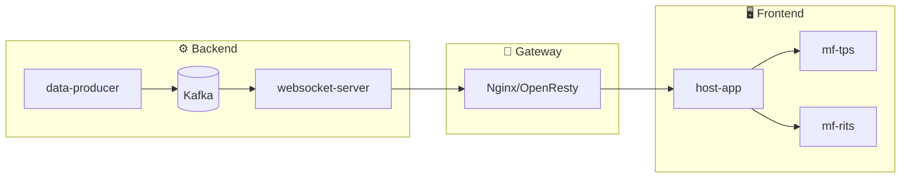
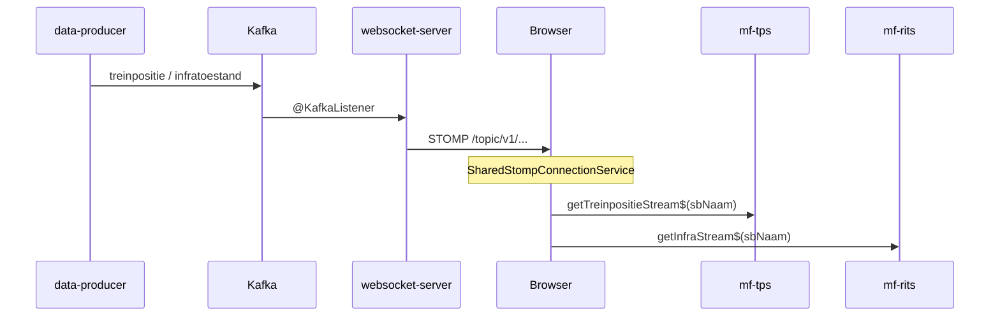
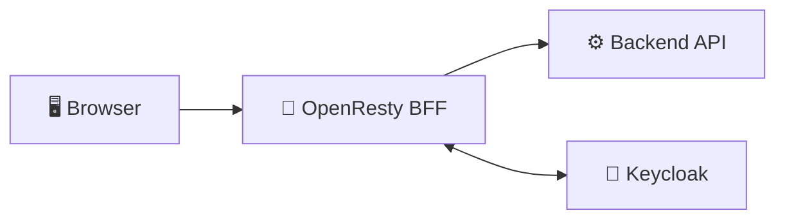
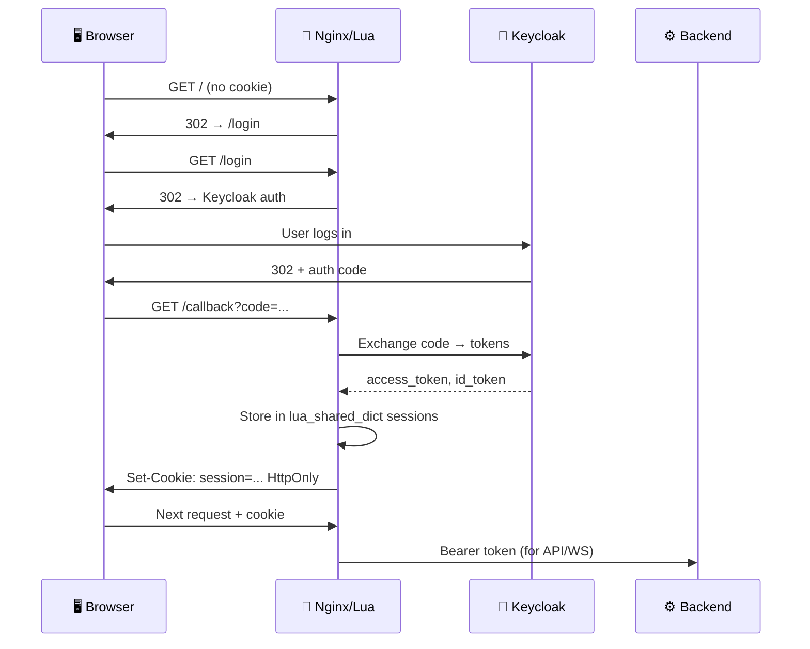
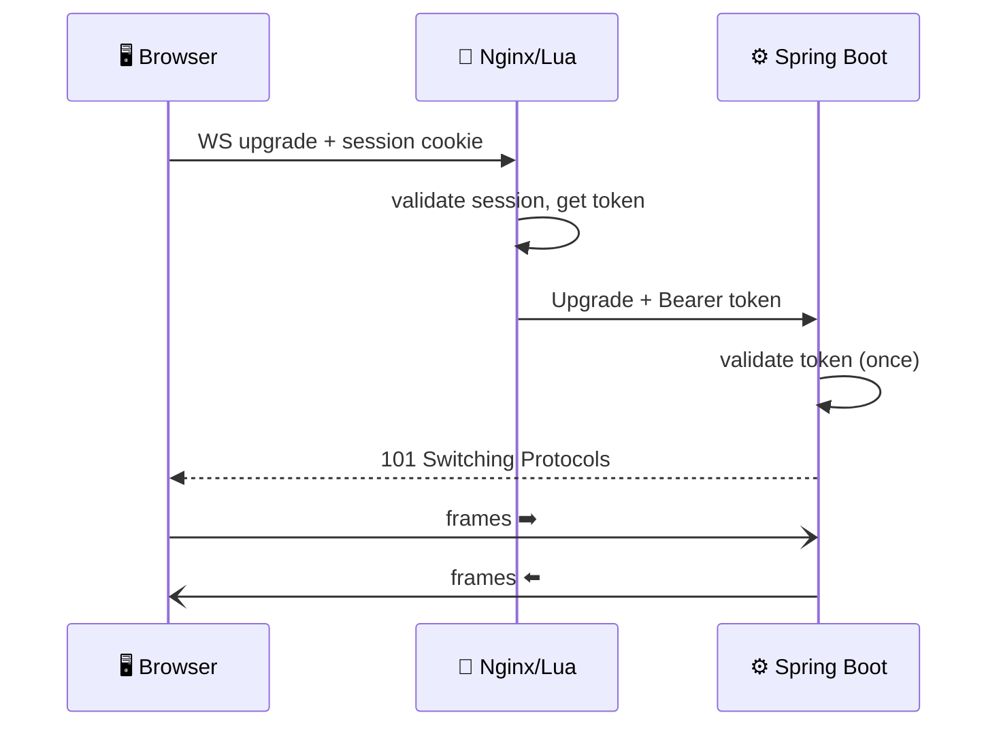

<div class="flex items-center justify-center gap-16 h-full">

<div class="text-left">

<div class="text-6xl font-black text-white leading-tight">One Socket,<br>Many Frontends</div>

<div class="text-2xl mt-5 text-sky-400 font-light">Real-Time at Dutch Railways</div>

<div class="mt-6 text-gray-400 text-lg leading-relaxed">
Shared WebSocket + BFF with OpenResty.<br>
From socket storm to a single pipe.
</div>

<div class="mt-8 text-gray-600 text-xs tracking-widest uppercase">
Angular · Native Federation · Kafka · OpenResty · Lua · Keycloak
</div>

</div>

<div class="flex flex-col items-center gap-3">
  <div class="w-44 h-24 rounded-2xl bg-sky-500 flex items-center justify-center text-white font-black text-sm shadow-2xl border-b-4 border-sky-700">🖥️ Host + MFEs</div>
  <div class="flex gap-3">
    <div class="w-40 h-24 rounded-2xl bg-emerald-500 flex items-center justify-center text-white font-black text-sm shadow-2xl border-b-4 border-emerald-700">🚪 Nginx BFF</div>
    <div class="w-36 h-24 rounded-2xl bg-amber-400 flex items-center justify-center text-white font-black text-sm shadow-2xl border-b-4 border-amber-600">🔑 Keycloak</div>
  </div>
  <div class="w-48 h-24 rounded-2xl bg-green-700 flex items-center justify-center text-white font-black text-sm shadow-2xl border-b-4 border-green-900">⚙️ Spring Boot<br>WebSocket</div>
</div>

</div>

---
layout: center
class: text-center
---

# The Stakes 🚂

<div class="grid grid-cols-2 gap-10 mt-10 text-left">

<div class="p-6 rounded-xl bg-slate-800 border border-slate-600">
<div class="text-xl mb-2 text-sky-300">ProRail · NS</div>
<div class="text-gray-300">7,000+ km track, 400+ stations, 1.3M passengers/day. Spoorviewer = the screen where traffic controllers see <strong>live</strong> train positions, infrastructure status, and incidents.</div>
</div>

<div class="p-6 rounded-xl bg-amber-950 border border-amber-700">
<div class="text-xl mb-2 text-amber-300">⏱️ Real-time is not optional</div>
<div class="text-gray-300">Stale data → wrong decisions. One WebSocket per user, shared by all microfrontends.</div>
</div>

</div>

---
layout: center
class: text-center
---

# Architecture We Built

<div class="text-lg text-sky-300 mb-4">TPS EMS → Kafka → STOMP WebSocket → Angular MFEs</div>



<v-click>

<div class="mt-6 p-4 rounded-lg bg-slate-800 text-gray-300">
One Spring Boot BFF, one Kafka, one WebSocket endpoint — multiple microfrontends behind one gateway.
</div>

</v-click>

---
layout: center
class: text-center
---

# The Problem We Solved 🤯

<v-click>

<div class="text-4xl font-bold mb-6 text-red-400">
N MFEs × 1 WebSocket each = socket storm
</div>

</v-click>

<v-click>

<div class="grid grid-cols-3 gap-6 mt-10">

<div class="p-4 rounded-xl bg-red-950 border border-red-700 text-center">
  <div class="text-3xl mb-2">🖥️</div>
  <div class="text-red-300 font-bold">Train Map MFE</div>
  <div class="text-sm text-gray-400">own STOMP connection</div>
</div>
<div class="p-4 rounded-xl bg-red-950 border border-red-700 text-center">
  <div class="text-3xl mb-2">🛤️</div>
  <div class="text-red-300 font-bold">Infra MFE</div>
  <div class="text-sm text-gray-400">own STOMP connection</div>
</div>
<div class="p-4 rounded-xl bg-red-950 border border-red-700 text-center">
  <div class="text-3xl mb-2">📦</div>
  <div class="text-red-300 font-bold">Shell</div>
  <div class="text-sm text-gray-400">maybe another?</div>
</div>

</div>

</v-click>

<v-click>

<div class="mt-8 p-4 rounded-lg bg-red-900/50 text-red-200">
More server load, connection limits, duplicate subscriptions, harder to debug.
</div>

</v-click>

---
layout: center
class: text-center
---

# The Goal ✨

<div class="text-3xl font-bold mb-10 text-white">
One WebSocket per user. Shared by all MFEs.
</div>

<v-clicks>

<div class="flex flex-wrap justify-center gap-6 text-lg">

<div class="p-4 rounded-xl bg-sky-900 border border-sky-600">Singleton STOMP in the browser</div>
<div class="p-4 rounded-xl bg-emerald-900 border border-emerald-600">Native Federation shares the instance</div>
<div class="p-4 rounded-xl bg-amber-900 border border-amber-600">Each MFE only subscribes to its topics</div>
<div class="p-4 rounded-xl bg-purple-900 border border-purple-600">Deploy independently, runtime = one socket</div>

</div>

</v-clicks>

---
layout: two-cols
---

# Shared WebSocket Library 🧱

<div class="text-sky-300 font-semibold mb-2">One package: <code>shared-websocket</code></div>

```typescript
@Injectable({ providedIn: 'root' })
export class SharedStompConnectionService {
  private readonly rxStomp = new RxStomp();
  private activated = false;

  connect(): void {
    if (this.activated) return;
    this.activated = true;
    this.rxStomp.configure({
      webSocketFactory: () =>
        new WebSocket(`ws://${location.host}/ws`),
    });
    this.rxStomp.activate();
  }

  getRxStompInstance(): RxStomp {
    return this.rxStomp;
  }
}
```

::right::

<v-click>

<div class="p-4 rounded-xl bg-emerald-900/50 border border-emerald-600">
✅ One <code>connect()</code>, same <code>RxStomp</code> everywhere.
</div>

</v-click>

<v-click>

<div class="mt-6 text-sm text-gray-400">
Host and all remotes import <code>SharedStompConnectionService</code> from <code>shared-websocket</code>. Federation ensures a single singleton.
</div>

</v-click>

---
layout: two-cols
---

# MFE: TPS Data Service 📡

<div class="text-sm text-gray-400 mb-2">mf-tps talks only to the shared service</div>

```typescript
import { SharedStompConnectionService } from 'shared-websocket';

@Injectable({ providedIn: 'root' })
export class TpsDataService {
  constructor(
    private readonly stompConnection: SharedStompConnectionService
  ) {}

  getTreinpositieStream$(sbNaam: string) {
    const rxStomp = this.stompConnection.getRxStompInstance();
    const snapshot$ = rxStomp
      .watch(APP_PREFIX + sbNaam)
      .pipe(take(1), map(msg => JSON.parse(msg.body)));
    const live$ = rxStomp
      .watch(TOPIC_PREFIX + sbNaam)
      .pipe(map(msg => JSON.parse(msg.body)));
    return merge(snapshot$, live$);
  }
}
```

::right::

<v-click>

<div class="p-4 rounded-xl bg-sky-900/50 border border-sky-600">
No <code>new RxStomp()</code>. Always the singleton.
</div>

</v-click>

---
layout: two-cols
---

# Native Federation Config ⚙️

<div class="text-sm text-gray-400 mb-2">Remotes and host share <code>shared-websocket</code></div>

```javascript
// federation.config.js (mf-tps, mf-rits, host-app)
const { withNativeFederation, shareAll } =
  require('@angular-architects/native-federation/config');

module.exports = withNativeFederation({
  name: 'mf-tps',
  exposes: { './Component': './src/app/tps-viewer/...' },
  shared: {
    ...shareAll({ singleton: true, strictVersion: true }),
  },
});
```

::right::

<v-click>

<div class="p-4 rounded-xl bg-emerald-900/50 border border-emerald-600">
<code>file:../shared-websocket</code> in package.json → Federation bundles it once and shares it.
</div>

</v-click>

---
layout: center
class: text-center
---

# Docker: The Gotcha 🐳

<v-click>

<div class="text-xl font-bold mb-4 text-amber-300">
Locally <code>file:../shared-websocket</code> works. In Docker?
</div>

</v-click>

<v-click>

Containers only mount their own app folder: <code>./mf-tps:/app</code> → no <code>../shared-websocket</code> inside the container.
</v-click>

<v-click>

<div class="mt-8 p-6 rounded-xl bg-amber-950 border border-amber-700 text-left font-mono text-lg max-w-2xl mx-auto">
# docker-compose.yml — fix
volumes:
  - ./mf-tps:/app
  - ./shared-websocket:/shared-websocket   # ← add this
</div>

</v-click>

<v-click>

<div class="mt-6 text-gray-400">
Then fix tsconfig <code>paths</code> / <code>include</code> so the build resolves <code>shared-websocket</code>. <code>Could not resolve "/shared-websocket/src/index"</code> → gone.
</div>

</v-click>

---
layout: center
class: text-center
---

# End-to-End Flow (Shared Socket)

<div style="transform: scale(0.85); transform-origin: top center;">



</div>

<v-click>

<div class="mt-4 text-xl text-emerald-400">
One connection, many subscriptions. No socket storm.
</div>

</v-click>

---
layout: center
class: text-center
---

# Part 2: The BFF — OpenResty + Lua 🚪

<div class="text-2xl mt-8 text-sky-300">After solving the shared WebSocket, we still need:</div>

<v-click>

<div class="grid grid-cols-3 gap-8 mt-10">

<div class="p-6 rounded-xl bg-slate-800 border border-slate-600">
  <div class="text-4xl mb-3">🔐</div>
  <div class="font-bold text-white">Auth</div>
  <div class="text-sm text-gray-400">OIDC with Keycloak — tokens never touch the browser</div>
</div>
<div class="p-6 rounded-xl bg-slate-800 border border-slate-600">
  <div class="text-4xl mb-3">🚪</div>
  <div class="font-bold text-white">Gateway</div>
  <div class="text-sm text-gray-400">OpenResty (Nginx + Lua) as BFF</div>
</div>
<div class="p-6 rounded-xl bg-slate-800 border border-slate-600">
  <div class="text-4xl mb-3">⚡</div>
  <div class="font-bold text-white">WebSocket</div>
  <div class="text-sm text-gray-400">Authenticate at handshake, then full speed</div>
</div>

</div>

</v-click>

---
layout: center
class: text-center
---

# Why BFF? 🤔

<div class="grid grid-cols-2 gap-12 mt-10 text-left">

<div class="p-6 rounded-xl bg-red-950 border border-red-700">
<div class="text-2xl mb-3">😰 Naive approach</div>
<div class="text-gray-300">Browser stores the token → <code>localStorage</code> = XSS risk. Every service reimplements auth.</div>
</div>

<div class="p-6 rounded-xl bg-emerald-950 border border-emerald-700">
<div class="text-2xl mb-3">✅ BFF approach</div>
<div class="text-gray-300">Gateway handles everything. Tokens stay <strong>server-side</strong>. Browser gets only a cookie.</div>
</div>

</div>

---
layout: center
class: text-center
---

# Why Lego? 🧱

<div class="text-xl mt-4 text-gray-300">Each block does one thing — snap them together → secure gateway.</div>



<div class="grid grid-cols-3 gap-6 mt-8 text-sm">

<div class="p-4 rounded-xl bg-sky-900 border border-sky-600 text-center">
  <div class="text-2xl mb-2">🧱</div>
  <div class="font-bold text-sky-300">OIDC</div>
  <div class="text-gray-400">standard brick</div>
</div>
<div class="p-4 rounded-xl bg-emerald-900 border border-emerald-600 text-center">
  <div class="text-2xl mb-2">🟩</div>
  <div class="font-bold text-emerald-300">Nginx/Lua</div>
  <div class="text-gray-400">baseplate</div>
</div>
<div class="p-4 rounded-xl bg-amber-900 border border-amber-600 text-center">
  <div class="text-2xl mb-2">🔌</div>
  <div class="font-bold text-amber-300">Custom Lua</div>
  <div class="text-gray-400">connector</div>
</div>

</div>

---
layout: center
class: text-center
---

# Tech Stack 🏗️

| 🔑 Keycloak | Identity provider — issues tokens |
|-------------|-----------------------------------|
| 🚪 OpenResty | Nginx + LuaJIT — the smart proxy |
| 🧩 Custom Lua (oidc_helper) | Authorization URL, code exchange, session in shared dict |
| 🖥️ Angular SPA | Frontend — no auth logic |
| ⚙️ Spring Boot | WebSocket server — validates Bearer token once per connection |

---
layout: center
class: text-center
---

# Login Flow 🔄

<div style="transform: scale(0.6); transform-origin: top center; margin-top: -3rem;">



</div>

<v-click>

<div class="mt-2 text-lg text-emerald-400">The token never touches the browser. 🔒</div>

</v-click>

---
layout: center
class: text-center
---

# The Magic Moment ✨

<div class="text-3xl mt-10">The <strong>token never hits the browser</strong>.</div>

<div class="grid grid-cols-2 gap-8 mt-10 max-w-3xl mx-auto">

<div class="p-6 rounded-xl bg-slate-800 border border-slate-600">
  <div class="text-sky-300 font-bold">🌐 Browser has</div>
  <code class="text-lg">session=abc123</code><br>
  <span class="text-sm text-gray-400">HttpOnly cookie only</span>
</div>

<div class="p-6 rounded-xl bg-slate-800 border border-slate-600">
  <div class="text-emerald-300 font-bold">🚪 Gateway has</div>
  <code class="text-lg">eyJhbGci...</code><br>
  <span class="text-sm text-gray-400">in server memory (shared dict)</span>
</div>

</div>

<div class="mt-10 text-emerald-400 text-xl font-bold">XSS cannot steal what it never sees. 🔒</div>

---
layout: center
class: text-center
---

# WebSocket + BFF: The Challenge ⚡

<div class="mt-8 text-xl text-gray-300">

WebSocket is <strong>stateful</strong> — one long-lived connection.

OIDC is <strong>stateless</strong> — token per request.

</div>

<v-click>

<div class="mt-8 text-2xl text-red-400">
You can't send a WebSocket to Keycloak. 🚫
</div>

</v-click>

<v-click>

<div class="mt-6 text-2xl text-emerald-400">
But you <strong>authenticate during the handshake</strong>. ✅
</div>

</v-click>

---
layout: two-cols
---

# WebSocket Handshake Flow 🤝

<div class="text-sm text-gray-400 mb-2">The upgrade is still an HTTP request.</div>

1. 🍪 Browser sends session cookie with the upgrade request
2. 🔍 Lua validates session — **same code as HTTP**
3. 🔑 Token read from server-side session
4. 📡 Nginx adds <code>Authorization: Bearer ...</code>
5. ⚙️ Spring Boot validates token **once** when connection opens
6. 📨 After that: pure WebSocket frames, full speed

::right::



---
layout: two-cols
---

# WebSocket in nginx.conf 🧱

```nginx
location /ws {
  access_by_lua_block {
    local oidc_helper = require "oidc_helper"
    local session = oidc_helper.get_session()
    if not session or not session.access_token then
      ngx.status = 401
      return ngx.exit(401)
    end
    ngx.req.set_header("Authorization",
      "Bearer " .. session.access_token)
  }

  proxy_http_version 1.1;
  proxy_set_header Upgrade    $http_upgrade;
  proxy_set_header Connection $connection_upgrade;
  proxy_pass http://tps_websocket_backend;
}
```

::right::

<v-click>

<div class="grid gap-4 text-sm mt-4">

<div class="p-3 rounded-lg bg-sky-900 border border-sky-600">🧱 Same Lego block — <code>oidc_helper.get_session()</code> for HTTP and WS</div>
<div class="p-3 rounded-lg bg-purple-900 border border-purple-600">🔒 Auth before upgrade — only at handshake</div>
<div class="p-3 rounded-lg bg-emerald-900 border border-emerald-600">⚡ Full speed after — no auth per frame</div>

</div>

</v-click>

---
layout: center
class: text-center
---

# Session Security (BFF) 🔐

<div class="grid grid-cols-2 gap-6 mt-8 text-left text-sm">

<div class="p-4 rounded-xl bg-red-900/40 border border-red-700">
  <span class="font-bold text-white">HttpOnly</span><br>
  <span class="text-gray-300">Cookie not readable by JS → mitigates XSS session theft</span>
</div>
<div class="p-4 rounded-xl bg-orange-900/40 border border-orange-700">
  <span class="font-bold text-white">Secure</span><br>
  <span class="text-gray-300">Cookie only over HTTPS in production</span>
</div>
<div class="p-4 rounded-xl bg-amber-900/40 border border-amber-700">
  <span class="font-bold text-white">SameSite=Lax</span><br>
  <span class="text-gray-300">Cookie only on same-site requests → CSRF protection</span>
</div>
<div class="p-4 rounded-xl bg-emerald-900/40 border border-emerald-700">
  <span class="font-bold text-white">Server-side session</span><br>
  <span class="text-gray-300">lua_shared_dict stores tokens; browser only has session id</span>
</div>

</div>

---
layout: center
class: text-center
---

# Full Picture 🗺️

```mermaid
flowchart TB
  subgraph Browser["🖥️ Browser"]
    H[host-app]
    T[mf-tps]
    R[mf-rits]
    WS[SharedStompConnectionService]
    H --> T
    H --> R
    T --> WS
    R --> WS
  end

  subgraph BFF["🚪 Nginx BFF (OpenResty)"]
    OIDC[OIDC Lua]
    WSP[/ws proxy]
    OIDC --> WSP
  end

  subgraph Backend["⚙️ Backend"]
    K[(Kafka)]
    W[websocket-server]
    K --> W
  end

  Browser -->|cookie + WS upgrade| BFF
  BFF -->|Bearer token| Backend
```

<v-click>

<div class="mt-6 text-lg text-sky-300">One socket per user · One BFF · Tokens server-side · Real-time for all MFEs</div>

</v-click>

---
layout: center
class: text-center
---

# Key Lessons 🎯

<div class="grid grid-cols-3 gap-8 mt-12">

<div class="p-6 rounded-xl bg-sky-900 border border-sky-600 text-center">
  <div class="text-4xl mb-3">🔌</div>
  <div class="font-bold text-sky-300">One socket</div>
  <div class="text-sm mt-1 text-gray-400">Shared WebSocket via Native Federation singleton</div>
</div>
<div class="p-6 rounded-xl bg-purple-900 border border-purple-600 text-center">
  <div class="text-4xl mb-3">🔒</div>
  <div class="font-bold text-purple-300">Tokens server-side</div>
  <div class="text-sm mt-1 text-gray-400">BFF + Lua; browser never sees tokens</div>
</div>
<div class="p-6 rounded-xl bg-emerald-900 border border-emerald-600 text-center">
  <div class="text-4xl mb-3">🧱</div>
  <div class="font-bold text-emerald-300">Lua = glue</div>
  <div class="text-sm mt-1 text-gray-400">Same OIDC flow for HTTP and WebSocket</div>
</div>

</div>

---
layout: center
class: text-center
---

# Before vs After

<div class="grid grid-cols-2 gap-12 mt-8 text-left">

<div class="p-6 rounded-xl bg-red-950/50 border border-red-700">
  <div class="text-xl font-bold text-red-300 mb-4">Without shared socket</div>
  <ul class="text-gray-300 space-y-2">
    <li>N MFEs → N WebSocket connections</li>
    <li>More load, duplicate heartbeats</li>
    <li>Hard to debug which connection dropped</li>
  </ul>
</div>

<div class="p-6 rounded-xl bg-emerald-950/50 border border-emerald-700">
  <div class="text-xl font-bold text-emerald-300 mb-4">With shared-websocket + BFF</div>
  <ul class="text-gray-300 space-y-2">
    <li>1 connection, N topic subscriptions</li>
    <li>One place to connect, reconnect, log</li>
    <li>BFF secures both HTTP and WS; tokens stay server-side</li>
  </ul>
</div>

</div>

---
layout: center
class: text-center
---

# Takeaways (1/2)

<v-clicks>

1. **Real-time at scale** — one WebSocket per user, shared across MFEs via Native Federation.
2. **shared-websocket** — small lib, one RxStomp, inject everywhere; Federation shares it as singleton.
3. **Docker** — mount <code>shared-websocket</code> in every MFE/host container so the build resolves it.
4. **BFF** — OpenResty + Lua handles OIDC; tokens stay server-side; browser gets only a session cookie.

</v-clicks>

---
layout: center
class: text-center
---

# Takeaways (2/2)

<v-clicks>

5. **WebSocket auth** — authenticate at handshake (same Lua session check), then proxy with Bearer token; backend validates once.
6. **Lego blocks** — OIDC + Nginx/Lua + custom oidc_helper = one secure gateway for HTTP and WebSocket.
7. **Stack** — Kafka → Spring Boot WebSocket → Nginx BFF (Lua) → Angular host + mf-tps + mf-rits. All runnable with <code>docker compose up</code>.

</v-clicks>

---
layout: center
class: text-center
---

# Questions? 💬

<div class="mt-12 text-xl text-gray-300">
One socket, many frontends. One BFF, tokens never in the browser.
</div>

<div class="mt-8 text-sm text-gray-500">
kafka-websockets-springboot-bff — Spring Boot · Angular Native Federation · OpenResty · Lua · Keycloak
</div>

---
layout: end
class: text-center
---

# Thank You 🚂

<div class="text-2xl mt-8 text-sky-400">Let's keep the trains moving.</div>

<div class="mt-12 text-gray-500 text-sm">
OpenResty · lua-resty-openidc style · Keycloak · Spring Boot · Docker
</div>
